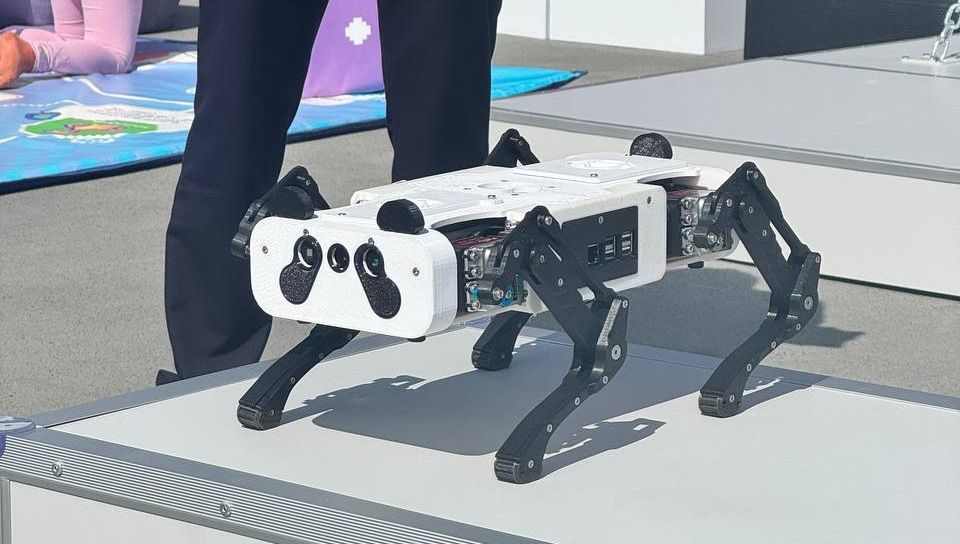

# RDS-2P-blueprint

Проект с чертежами малой робособаки для изготовления пластиковых деталей в стиле робота-панды. Техническое наименование: Robot Dog Small - 2 Plastic (RDS-2P)

## Состав репозитория

- `корпус/` - детали корпуса и связанные сборки.
- `ноги/` - сборки ног и вспомогательные элементы.
- `зарядная станция/` - чертежи зарядной станции.
- `переменные/` - параметрические конфигурации и общие размеры.
- `мет. изделия/` - стандартные и покупные металлические элементы.
- `электроника/` - посадочные и связанные элементы электроники.
- `export/` - экспортные материалы для печати и прочие материалы.

## Требуемое ПО

- T-Flex CAD: 17.1.36.0

## Компоненты

Список компонентов доступен в файле `компоненты.xlsx` в корне репозитория.